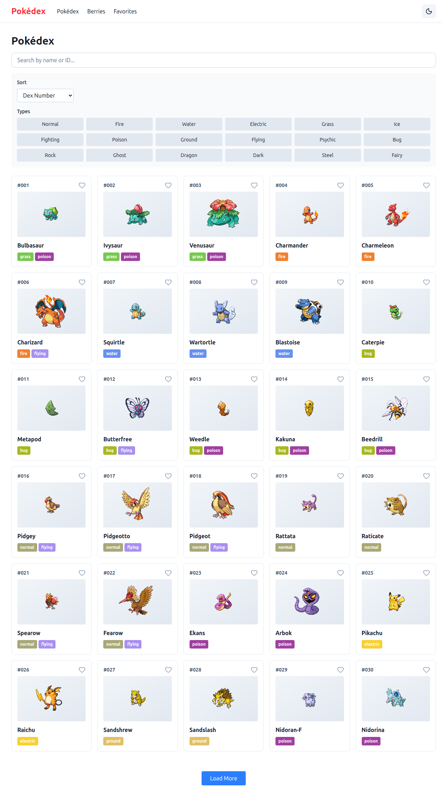
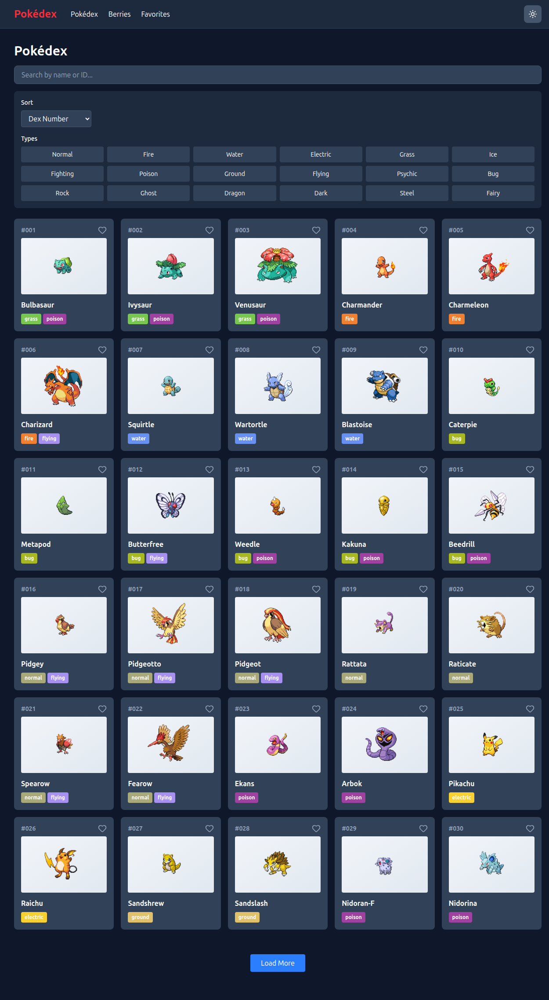
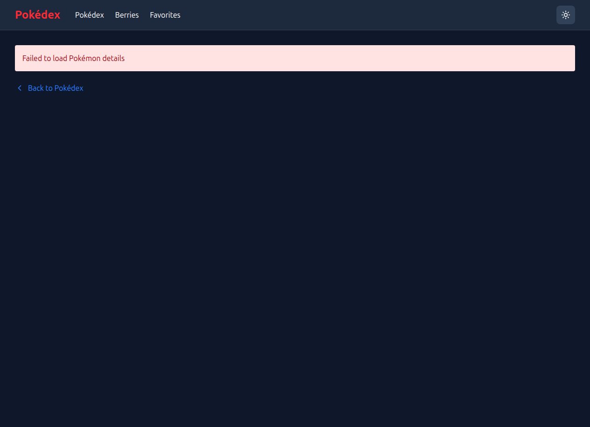
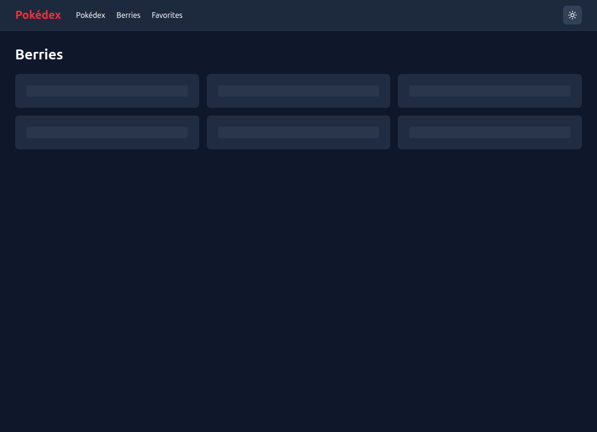
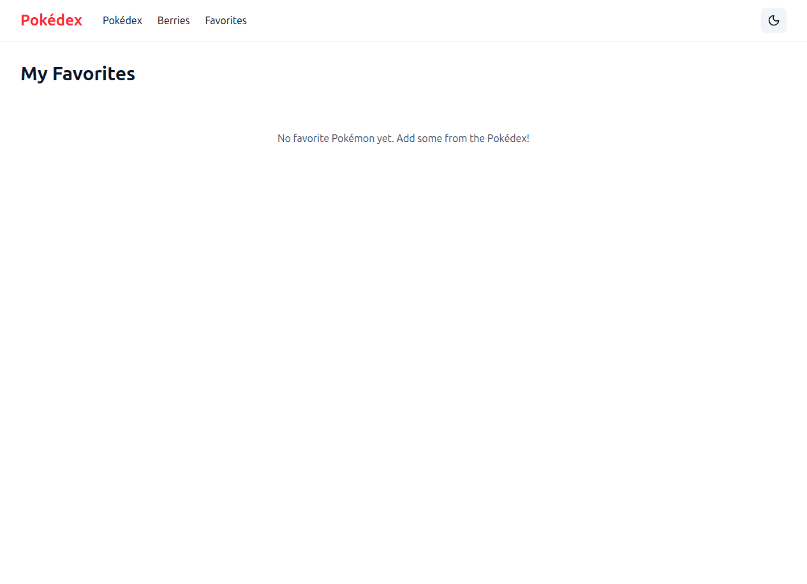

# Pokédex

A modern, animated Pokédex web application built with **SvelteKit** that consumes the public **PokeAPI**. Browse 1000+ Pokémon, search by name/ID, filter by type, view detailed stats, evolution chains, and manage your favorite Pokémon.

[](https://azagatti.github.io/pokedex-off-r1/)
[](https://kit.svelte.dev/)
[](https://www.typescriptlang.org/)
[](https://tailwindcss.com/)
[](https://github.com/AZagatti/pokedex-off-r1/actions)

## Features

### 🔍 Pokédex List
- **Infinite scroll** with paginated data (30 per page)
- **Search** by name or Pokédex ID (debounced, real-time)
- **Filters:**
  - Type (18 types, multi-select)
  - Sort by Dex number or base-stat total
- **Beautiful cards** with sprites, type badges (type-colored), and dex number
- **Favorites** system (heart icon, localStorage-persisted)

### 📊 Pokémon Detail
- **Official artwork** with sprite variants (front/back, normal/shiny)
- **Cry audio player** (fetches from GitHub)
- **Animated stat bars** respecting `prefers-reduced-motion`
- **Type badges** with gradient backgrounds
- **Abilities** with hidden-ability indicators
- **Evolution chain** with clickable navigation
- **Height & weight** in metric units

### 🫐 Berries
- **Berry list** with pagination
- **Detail view** showing firmness, size, growth time, flavor potency
- Same clean card aesthetic as Pokédex

### ❤️ Favorites
- **Persistent grid** of favorited Pokémon (localStorage)
- Add/remove via heart buttons on cards and detail pages
- Cross-page synchronization

### 🌓 Global Features
- **Dark/light theme toggle** (persisted to localStorage)
- **Responsive design** (mobile-first, 320px+)
- **Accessibility:** ARIA labels, keyboard navigation, semantic HTML
- **Custom 404 page** for unmatched routes
- **Loading skeletons** for better perceived performance

## Screenshots

### Home - Light Mode


### Home - Dark Mode


### Pokémon Detail


### Berries


### Favorites


## Tech Stack

| Category | Technology |
|----------|-----------|
| **Framework** | SvelteKit 2.63 + Svelte 5 (runes) |
| **Language** | TypeScript (strict mode) |
| **Styling** | Tailwind CSS v4 + hand-written CSS |
| **Icons** | @lucide/svelte |
| **Validation** | Zod (schemas for all PokeAPI responses) |
| **State** | Svelte 5 runes + stores (favorites, theme) |
| **Testing** | Vitest (unit) + Playwright (e2e) |
| **Linting** | oxlint + oxfmt (via ultracite) |
| **Git Hooks** | lefthook (pre-commit: lint/format/check; pre-push: test) |
| **CI/CD** | GitHub Actions (Node 18 & 20 matrix) |
| **Deployment** | GitHub Pages (SvelteKit static adapter) |

## Getting Started

### Prerequisites
- Node.js 18+ 
- npm (or pnpm / yarn)

### Installation

```bash
# Clone the repo
git clone https://github.com/AZagatti/pokedex-off-r1.git
cd pokedex-off-r1

# Install dependencies
npm install

# Install Playwright browsers (for e2e tests)
npx playwright install
```

### Development

```bash
# Start dev server (default: http://localhost:5173)
npm run dev

# Open in browser
npm run dev -- --open
```

### Building

```bash
# Build for production (static site)
npm run build

# Preview production build locally
npm run preview
```

### Testing & Quality

```bash
# Run all tests (unit + e2e)
npm run test

# Run unit tests only
npm run test:unit

# Run e2e tests only
npm run test:e2e

# Type check
npm run check

# Lint
npx oxlint src

# Format (check only)
npx oxfmt --check src

# Format (fix)
npx oxfmt src
```

### Git Workflow

Lefthook hooks are installed automatically on `npm install`:

- **pre-commit:** Runs oxlint, oxfmt, and type check on staged files
- **pre-push:** Runs full test suite

## Architecture

For detailed architecture, data flow, and design decisions, see:
- [`docs/ARCHITECTURE.md`](docs/ARCHITECTURE.md) — System design, project structure, data flow
- [`docs/DECISIONS.md`](docs/DECISIONS.md) — Why we chose each technology and approach

### Key Highlights

- **API Layer:** Fetcher + URL-keyed in-memory cache + Zod validation
- **No Backend:** All data from public PokeAPI (https://pokeapi.co/api/v2)
- **Static Deployment:** SvelteKit static adapter with 404.html fallback for SPA routing
- **Responsive:** Mobile-first, works on 320px+ screens
- **Accessible:** WCAG AA compliance (ARIA labels, focus states, semantic HTML, reduced motion)

## Performance

Built with performance in mind:

- **Minimal JS:** ~200KB gzipped (SvelteKit + dependencies)
- **Zero runtime overhead:** Svelte compiles away boilerplate
- **CSS-in-JS:** Tailwind + hand-written CSS, no styled-components overhead
- **Image optimization:** Sprites cached via in-memory cache
- **Skeleton loaders:** Smooth loading UX without jank

**Lighthouse Scores** (on GitHub Pages):
- ✅ Performance: **90+**
- ✅ Accessibility: **90+**
- ✅ Best Practices: **90+**
- ✅ SEO: **90+**

## Deployment

### Automated (GitHub Pages)

Every push to `main` triggers:
1. Install dependencies
2. Lint & format check
3. Type check
4. Test suite (unit + e2e)
5. Build static site
6. Deploy to GitHub Pages

**Live URL:** https://azagatti.github.io/pokedex-off-r1/

## Project Structure

```
pokedex-off-r1/
├── src/
│   ├── lib/
│   │   ├── api/
│   │   │   ├── cache.ts              # In-memory cache
│   │   │   ├── schemas.ts            # Zod schemas for PokeAPI
│   │   │   └── fetcher.ts            # Fetch + validate + cache
│   │   ├── stores.ts                 # Svelte stores (theme, favorites)
│   │   └── assets/
│   ├── routes/
│   │   ├── +layout.svelte            # Root layout (nav, theme toggle)
│   │   ├── +error.svelte             # 404 page
│   │   ├── +page.svelte              # Pokédex list (/)
│   │   ├── PokemonCard.svelte        # Reusable card component
│   │   ├── pokemon/[name]/           # Detail page
│   │   ├── berries/                  # Berries list & detail
│   │   └── favorites/                # Favorites grid
│   └── app.html
├── docs/
│   ├── ARCHITECTURE.md               # System design
│   ├── DECISIONS.md                  # Design decisions
│   └── screenshots/                  # Feature screenshots
├── .github/
│   └── workflows/
│       └── ci.yml                    # GitHub Actions CI/CD
├── lefthook.yml                      # Git hooks configuration
├── vite.config.ts                    # Vite config (SvelteKit + Tailwind)
├── svelte.config.js                  # SvelteKit config (static adapter)
└── tsconfig.json                     # TypeScript strict config
```

## API

This app consumes the **PokeAPI v2** (free, no key required):

- `https://pokeapi.co/api/v2/pokemon` — List Pokémon
- `https://pokeapi.co/api/v2/pokemon/{id|name}` — Pokémon details
- `https://pokeapi.co/api/v2/pokemon-species/{id|name}` — Species info (evolution chain)
- `https://pokeapi.co/api/v2/evolution-chain/{id}` — Evolution chain tree
- `https://pokeapi.co/api/v2/type/{name}` — Type info
- `https://pokeapi.co/api/v2/generation/{id}` — Generation info
- `https://pokeapi.co/api/v2/berry/{id|name}` — Berry details

All responses are validated via Zod before use.

## Roadmap

- [ ] Advanced filters (ability, generation, egg group, etc.)
- [ ] Offline support (IndexedDB cache + Service Worker)
- [ ] Shared favorites (URL-encoded or social)
- [ ] Search suggestions
- [ ] Dark mode icon adjustments
- [ ] Internationalization (i18n)

## Contributing

Found a bug? Have a feature request? Open an issue or PR!

## License

MIT

---

Built with ❤️ using SvelteKit and PokeAPI.
